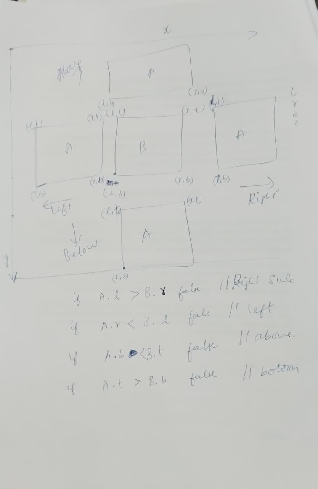

Before going to my Project Secure Chat Application I would like to explain about the code I coded proudly here is checking whether two rectangles interesect or not because i worked it with in book knowing possible logics to determine overlapping of rectangles here is the below work made by me shown in the image below

The above Image showns how i built logic and wrote psuedo code.

One project I am proud of is my Secure Chat Application with End-to-End Encryption.

The application allows users to exchange messages securely so that only the sender and intended receiver can read them. Even the server only stores encrypted messages and cannot decrypt their contents.

The most interesting part was implementing end-to-end encryption using public-key cryptography. Each user generates a public-private key pair. When sending a message, the sender encrypts it using the receiver's public key. Only the receiver's private key can decrypt it. I also implemented JSON Web Tokens (JWT) for user authentication, ensuring that only authenticated users could access the chat service. Socket programming was used to provide real-time messaging.

I am particularly proud of this project because it combines networking, cryptography, authentication, and full-stack development. It taught me how secure communication systems work in real-world applications and how different technologies integrate to build a reliable system.